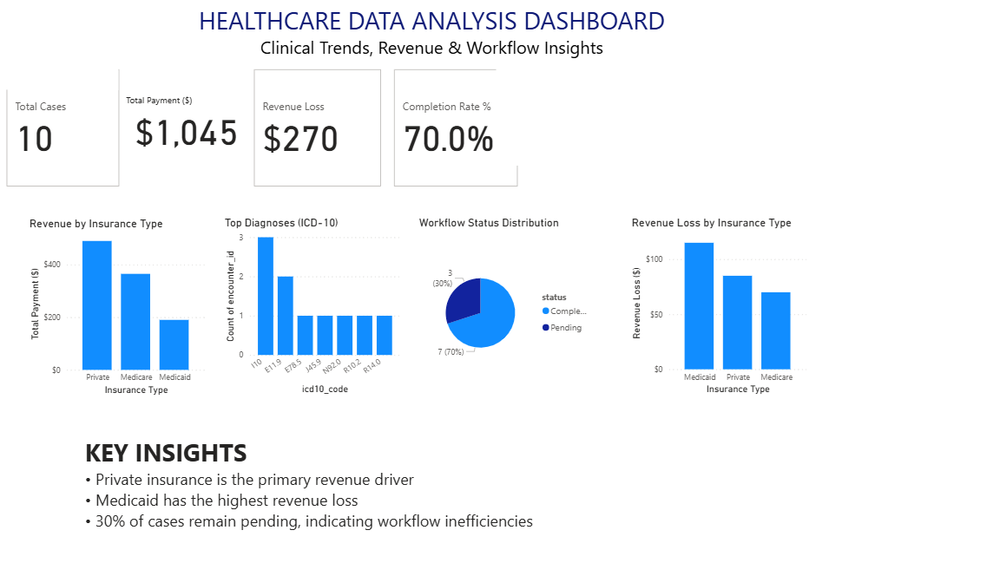

# 🏥 Healthcare Data Analysis Dashboard (SQL + Power BI Project)

## 📊 Project Overview
This project analyzes healthcare encounter data to uncover trends in revenue, diagnosis patterns, and workflow efficiency.

This project identifies revenue drivers, cost leakages, and workflow inefficiencies in healthcare operations using real-world style data.

The dashboard was built using **Power BI** and focuses on key performance indicators relevant to healthcare operations.

---

## 🛠️ Tools Used
- SQL Server (Data extraction & analysis)
- Power BI (Data visualization)
- Excel (initial data handling)

---

## 📈 Key Metrics
- Total Cases: 10
- Total Payment: $1,045
- Revenue Loss: $270
- Completion Rate: 70%

---

## 🔍 Key Insights
- Private insurance is the primary revenue driver.
- Medicaid contributes the highest revenue loss, indicating reimbursement gaps.
- 30% of cases remain pending, highlighting workflow inefficiencies.

---

## 📊 Dashboard Preview

---

## 📁 Files Included
- `Healthcare_dashboard.pbix` → Power BI dashboard file
- `healthcare_analysis.csv` → Dataset used
- `Dashboard_screenshot.png` → Dashboard preview

---

## 🎯 Project Purpose
This project demonstrates:
- Data cleaning and transformation
- SQL-based analysis
- Business insight generation
- Dashboard design in Power BI

---

## 💡 Skills Demonstrated
- Data cleaning and preparation using SQL
- Aggregation and KPI calculation
- Data modeling concepts
- DAX measure creation in Power BI
- Data storytelling and dashboard design

---

## 🚀 Future Improvements
- Add time-based trend analysis
- Include patient demographics insights
- Build interactive filters for deeper analysis
